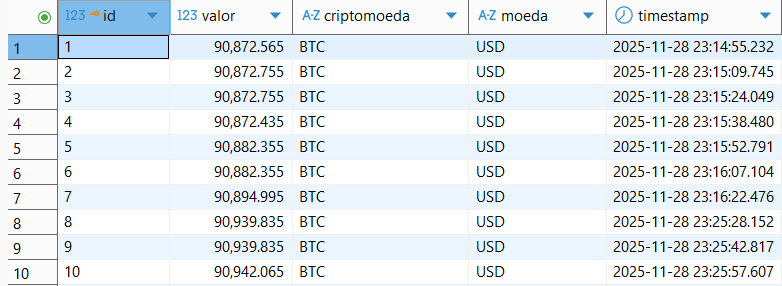

# **Pipeline de coleta, transformação e armazenamento de dados do Bitcoin**

### Resumo

Este projeto implementou um pipeline de ETL (Extract, Transform, Load) para coletar, processar e armazenar dados do Bitcoin em um banco de dados PostgreSQL. Um script Python foi usado para:

- Obter as cotações em tempo real por meio da API da Coinbase;

- Transformar os dados de acordo com o formato necessário para inserção em um banco de dados estruturado; e 

- Carregar os dados no banco.

### Índice

- [1. Ferramentas utilizadas](https://github.com/luisamuzzi/projeto_etl_bitcoin?tab=readme-ov-file#1-ferramentas-utilizadas)
- [2. Estrutura do código](https://github.com/luisamuzzi/projeto_etl_bitcoin?tab=readme-ov-file#2-estrutura-do-c%C3%B3digo)
- [3. Estrutura da tabela final](https://github.com/luisamuzzi/projeto_etl_bitcoin?tab=readme-ov-file#3-estrutura-da-tabela-final)
- [4. Estratégia de solução](https://github.com/luisamuzzi/projeto_etl_bitcoin?tab=readme-ov-file#4-estrat%C3%A9gia-de-solu%C3%A7%C3%A3o)
- [5. O produto final do projeto](https://github.com/luisamuzzi/projeto_etl_bitcoin?tab=readme-ov-file#5-o-produto-final-do-projeto)
- [6. Conclusão](https://github.com/luisamuzzi/projeto_etl_bitcoin?tab=readme-ov-file#6-conclus%C3%A3o)

### 1. Ferramentas utilizadas

**Linguagens:**

- Python: linguagem de programação principal

- SQL: criação da tabela e gravação dos dados no banco de dados

**Bibliotecas Python:**

- `requests`: usada para fazer requisições HTTP.

- `psycopg2`: usada para interagir com o banco de dados PostgreSQL.

- `os`: usada para obter os valores das variáveis de ambiente.

- `dotenv`: usada para gerenciar as variáveis de ambiente.

- `datetime`: usada para obter o timestamp das extrações de dados.

- `time`: usada para definir o tempo entre cada extração de dados.

**Banco de dados:**

- PostgreSQL: usado para armazenar os dados.

**Plataforma Cloud:**

- Render: usado para hospedar o banco de dados na nuvem. 

**API:**

- Coinbase API: usada para obter os dados do Bitcoin.

### 2. Estrutura do código

**Funções:**

- `extract_bitcoin_data()`: extrai os dados do Bitcoin via API.

- `transform_bitcoin_data(data)`: realiza transformações nos dados extraídos para prepará-los para inserção em banco de dados estruturado.

- `create_table()`: conecta ao banco de dados PostgreSQL e cria uma tabela na qual serão armazenados os dados do Bitcoin, caso ela ainda não exista.

- `load_bitcoin_postgres(data)`: conecta ao banco de dados PostgreSQL e insere os dados de valor, criptomoeda, moeda e timestamp.

**Execução:**

Ao ser iniciado, o script verifica a existência da tabela e a cria no banco de dados caso ela não exista. Após isso, um loop é executado para que o processo de ETL dos dados ocorra de forma contínua a cada 15 segundos. Esse loop pode ser interrompido manualmente por meio de `Ctrl+C`.

Ao longo do processo o script exibe logs informando sobre o status, como mensagens de sucesso e erro.

### 3. Estrutura da tabela final

A tabela de dados que armazena os dados coletados no PostgreSQL tem a estrutura:

|**Coluna** |**Tipo**   |**Descrição**                    |
|-----------|-----------|---------------------------------|
|id         |SERIAL     |Identificador único do registro  |
|valor      |NUMERIC    |Valor do Bitcoin                 |
|criptomoeda|VARCHAR(10)|Código da criptomoeda            |
|moeda      |VARCHAR(10)|Moeda de referência              |
|timestamp  |TIMESTAMP  |Data e hora da coleta do registro|

### 4. Estratégia de solução

1. Inicialização do ambiente virtual com pyenv e poetry:

O `pyenv` foi usado para gestão da versão do Python usada no projeto e o `poetry` para a gestão das bibliotecas.

2. Hospedagem do banco de dados no Render:

O banco de dados PostgreSQL foi criado no Render.com para simular o uso de um ambiente em nuvem.

3. Criação do script Python:

O script Python foi criado para realização do processo de ETL conforme descrito nas seções anteriores.

4. Acesso aos dados:

Os dados podem ser acessados conectando-se ao banco de dados PostgreSQL por meio das credenciais de acesso usando IDEs como DBeaver e pgAdmin ou um script Python.

### 5. O produto final do projeto

1. [Script Python](src/pipeline.py) que realiza o processo de ETL.

2. Tabela com dados armazenados:

### 6. Conclusão

Este projeto criou e automatizou um pipeline de ETL para coleta, transformação e carga de dados do Bitcoin em um banco de dados PostgreSQL por meio de um script Python. Para tanto, foram utilizadas as bibliotecas `requests`, `psycopg2`, `os`, `dotenv`, `datetime` e `time`. A API da Coinbase foi usada para extração dos dados e o banco de dados foi hospedado numa plataforma de nuvem.